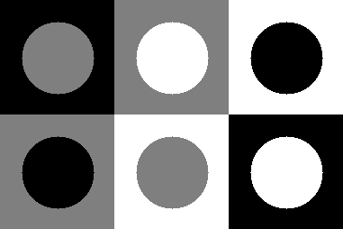
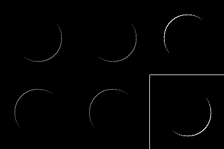
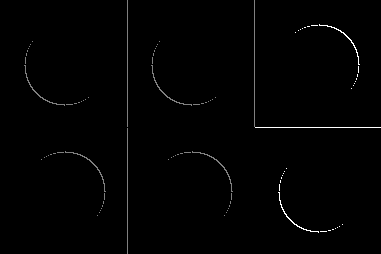
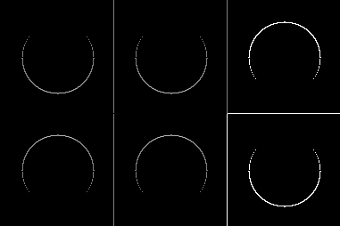
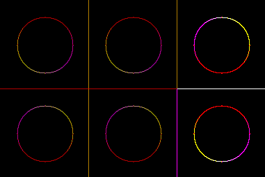

Разработка приложения, которое:

Генерирует тестовое изображение, состоящее из квадратов с кругами, где все возможные комбинации яркостей (0, 127, 255) представлены;

Обработка включает следующие шаги:

I₁: результат фильтрации с ядром M₁

I₂: результат фильтрации с ядром M₂

I₃: градиентная амплитуда sqrt(I₁² + I₂²)

V₁–V₃: визуализация I₁–I₃ (нормализовано для отображения)

V₄: RGB-изображение: V₁ → R, V₂ → G, V₃ → B

Оригинал:

Фильтры:

