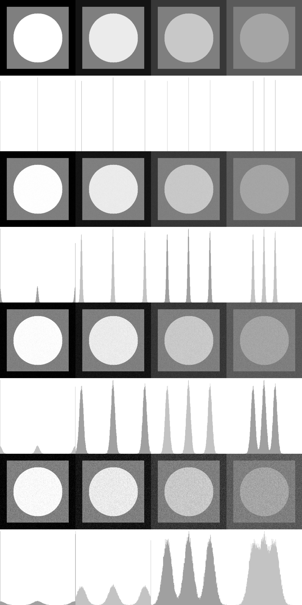

Описание проекта
Этот проект содержит две программы для анализа и визуализации изображений:

generate_histograms - генерирует изображение с гистограммами для различных уровней шума

compute_statistics - вычисляет статистику по различным областям изображений

Зависимости
Для работы проекта необходимы:

OpenCV 4.x

Компилятор C++ с поддержкой C++20

CMake 3.10 или выше

Библиотека semcv (включена в проект)

Особенности сборки на MacBook с ARM
Проект был собран и протестирован на MacBook с процессором Apple Silicon M2.

Генерация гистограмм
./build/generate_histograms <путь-для-сохранения-изображения>

Вычисление статистики
./build/compute_statistics
Image Parameters: L0=0 L1=127 L2=255

Noise Level (σ=3):
Circle: μ=253.544 σ=1.9333
Inner Square: μ=126.535 σ=3.02654
Background: μ=0.965712 σ=1.59585

Noise Level (σ=7):
Circle: μ=251.951 σ=4.2626
Inner Square: μ=126.58 σ=7.0345
Background: μ=2.56438 σ=3.92873

Noise Level (σ=15):
Circle: μ=248.764 σ=8.92072
Inner Square: μ=126.668 σ=15.0601
Background: μ=5.77584 σ=8.60532

Image Parameters: L0=20 L1=127 L2=235

Noise Level (σ=3):
Circle: μ=234.499 σ=3.00804
Inner Square: μ=126.535 σ=3.02654
Background: μ=19.4887 σ=3.04251

Noise Level (σ=7):
Circle: μ=234.487 σ=6.98683
Inner Square: μ=126.58 σ=7.0345
Background: μ=19.4833 σ=7.05259

Noise Level (σ=15):
Circle: μ=233.899 σ=13.899
Inner Square: μ=126.668 σ=15.0601
Background: μ=20.1801 σ=13.8284

Image Parameters: L0=55 L1=127 L2=200

Noise Level (σ=3):
Circle: μ=199.499 σ=3.00804
Inner Square: μ=126.535 σ=3.02654
Background: μ=54.4887 σ=3.04251

Noise Level (σ=7):
Circle: μ=199.49 σ=6.99884
Inner Square: μ=126.58 σ=7.0345
Background: μ=54.4763 σ=7.07413

Noise Level (σ=15):
Circle: μ=199.482 σ=14.9789
Inner Square: μ=126.668 σ=15.0601
Background: μ=54.4509 σ=15.1454

Image Parameters: L0=90 L1=127 L2=165

Noise Level (σ=3):
Circle: μ=164.499 σ=3.00804
Inner Square: μ=126.535 σ=3.02654
Background: μ=89.4887 σ=3.04251

Noise Level (σ=7):
Circle: μ=164.49 σ=6.99884
Inner Square: μ=126.58 σ=7.0345
Background: μ=89.4763 σ=7.07413

Noise Level (σ=15):
Circle: μ=164.482 σ=14.9803
Inner Square: μ=126.668 σ=15.0601
Background: μ=89.4499 σ=15.1494

