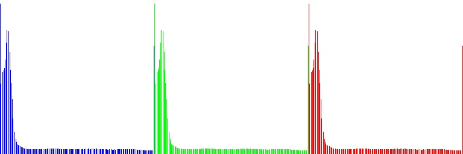

Задача
Реализовать функцию автоконтрастирования для

Серых изображений (8 bpp)

Цветных изображений (наивный вариант)

Провести тестирование и визуализацию гистограмм и результатов

Результаты на серых изображениях

Исходное изображение:

Гистограмма до автоконтраста:

Изображение после автоконтраста:

Гистограмма после автоконтраста:

Результаты на цветных изображениях (наивная версия)

Исходное изображение:

Гистограмма до автоконтраста:

Изображение после автоконтраста:

Гистограмма после автоконтраста:

Ограниченное автоконтрастирование цветных изображений

Исходное изображение:

Гистограмма до автоконтраста:

Изображение после автоконтраста:

Гистограмма после автоконтраста:

Выводы
На серых изображениях автоконтрастирование улучшает детализацию и распределение яркости

На цветных изображениях наивный автоконтраст порой вызывает цветовые искажения

Ограниченное автоконтрастирование сохраняет естественный цвет, при этом улучшая контраст

Представленные визуализации и гистограммы подтверждают качественную работу алгоритмов

Все визуализации и результаты сохранены в каталоге lab3/report-imgs.
