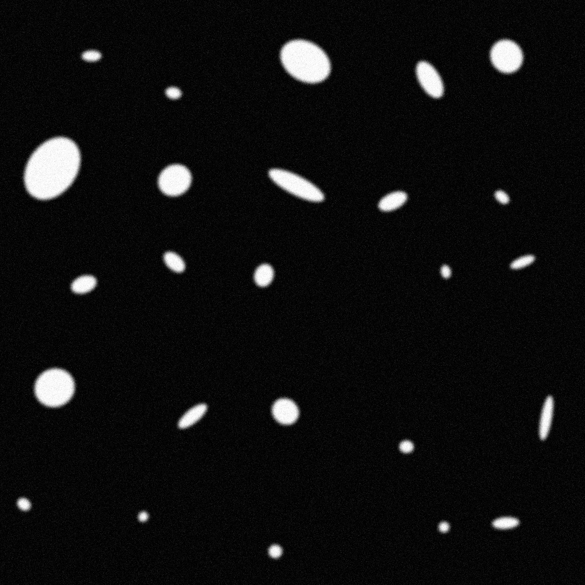
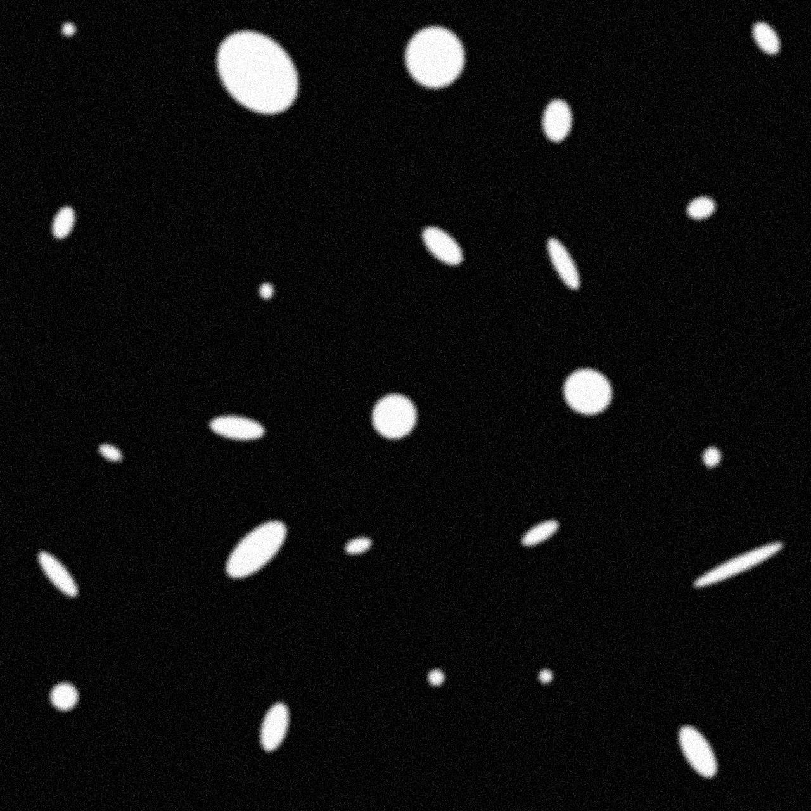
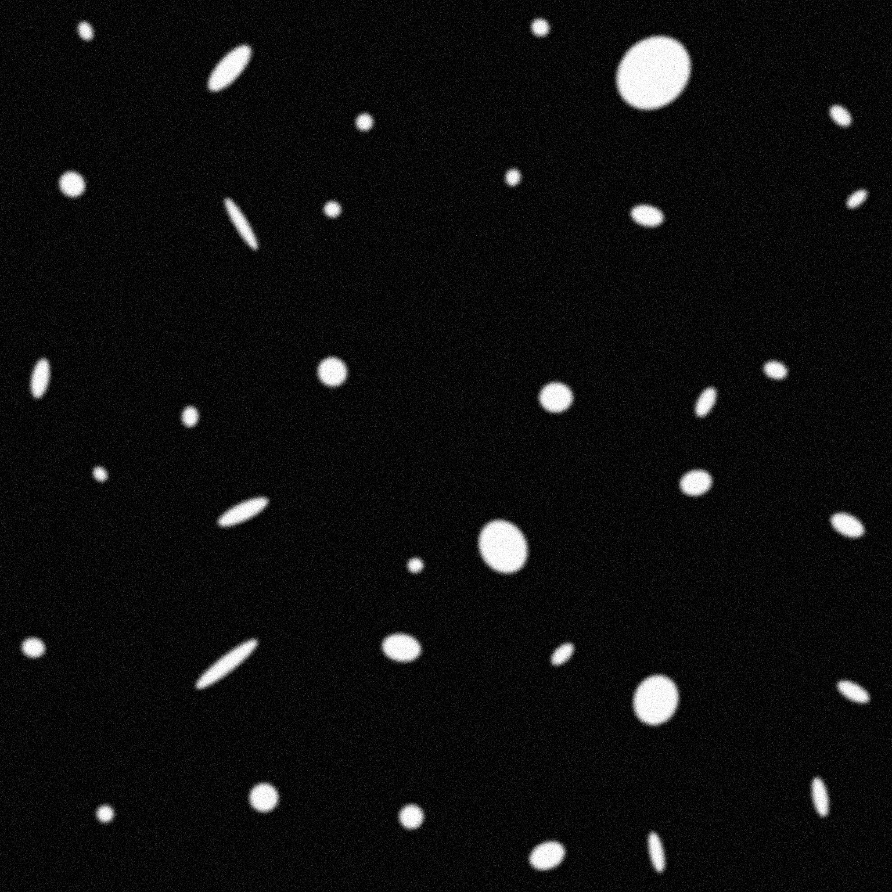
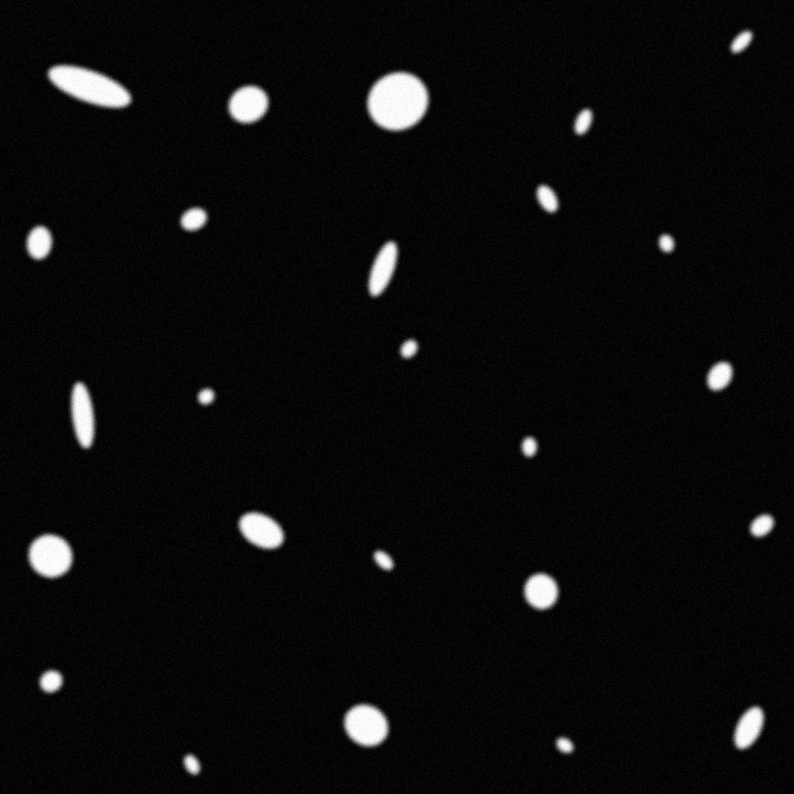
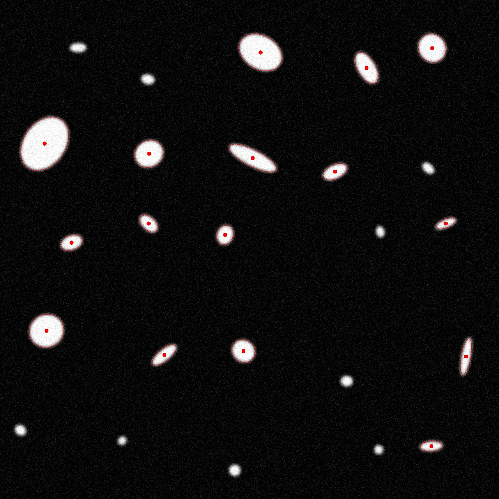
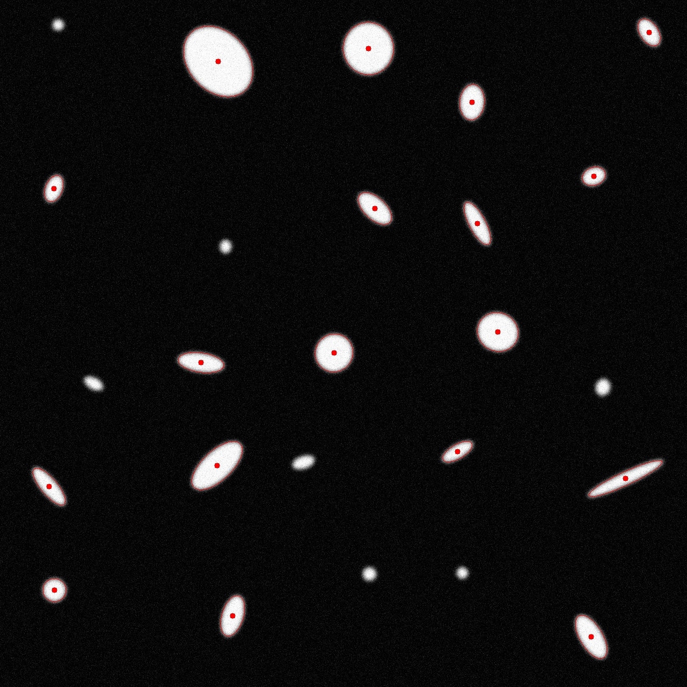
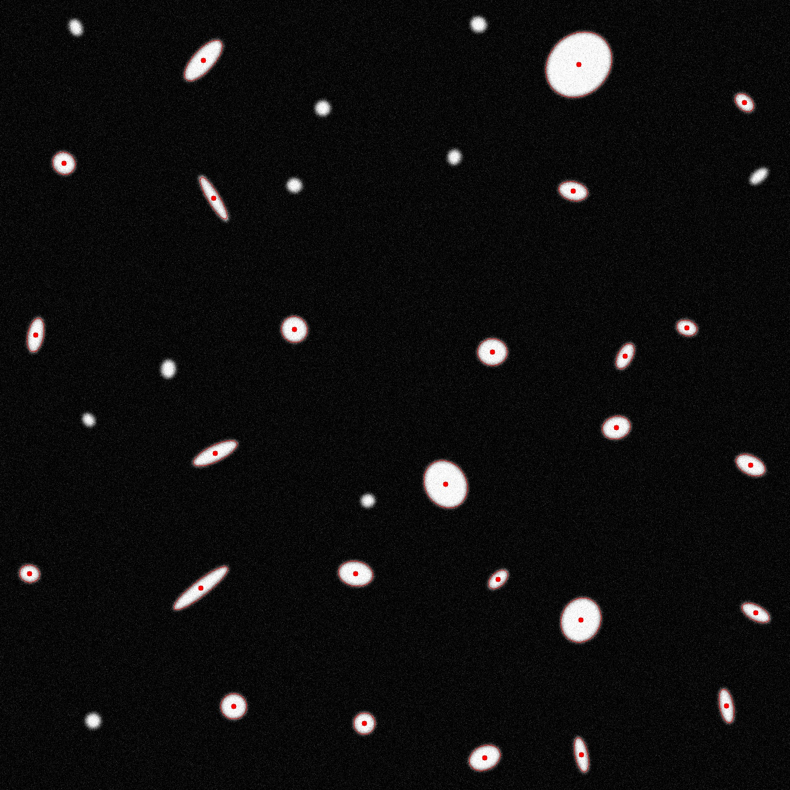
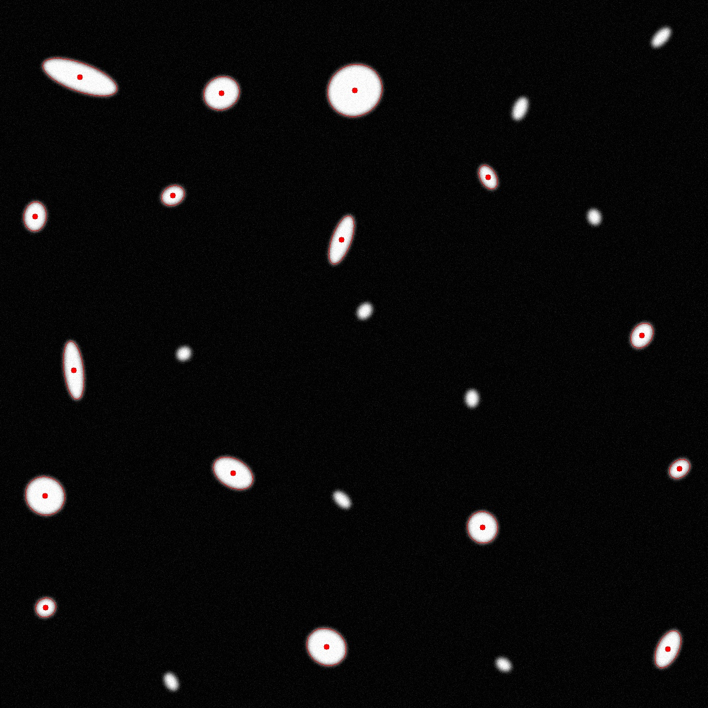

Детекция объектов с использованием бинаризации изображений
Часть 1: Генерация тестовых примеров
Программа task04_01.cpp — консольное приложение для генерации синтетических изображений, содержащих эллипсы.

Каждое изображение представляет собой сетку из квадратных тайлов размером 256×256 пикселей. В каждом тайле случайным образом размещается один эллипс с различной ориентацией, размером и положением.

Примеры сгенерированных изображений:





Кроме изображений, программа сохраняет JSON-файл с описанием всех эллипсов (координаты центра, размеры, угол поворота). Этот файл служит в дальнейшем «истинной разметкой» (ground-truth) для оценки качества алгоритма.

Пример ground-truth JSON можно найти в директории ./test-examples/ground-truth/

Часть 2: Алгоритм детекции объектов
Для детекции эллипсов был реализован алгоритм бинаризации, включающий следующие этапы:

Преобразование в градации серого

Гауссово размытие (для подавления шума)

Бинаризация по методу Отсу

Морфологические операции (открытие и закрытие) для очистки маски

Анализ компонент связности и извлечение контуров

Аппроксимация контуров эллипсами

Программа task04_02.cpp выполняет детекцию и сохраняет изображение с нанесёнными детектированными эллипсами. Также создаётся JSON-файл с координатами и параметрами каждого найденного эллипса.

Примеры изображений с визуализацией детекции:





Формат JSON-файла с результатами:
```json
"detections": [
        {
            "angle": 121.1808853149414,
            "area": 10038.171875,
            "height": 116.9868392944336,
            "width": 85.80599212646484,
            "x": 667.9863891601563,
            "y": 133.99412536621094
        }
```

Часть 3: Оценка качества (метрики)
Файл task04_03.cpp — утилита для автоматического сравнения результатов детекции с эталонной разметкой.
Вычисляются следующие метрики:

IoU (Intersection over Union) — мера пересечения предсказанных и настоящих эллипсов

Precision — точность (доля правильно найденных объектов среди всех найденных)

Recall — полнота (доля найденных объектов среди всех существующих)

F1-score — гармоническое среднее между точностью и полнотой

Метрики рассчитываются как по каждому изображению, так и в среднем по всем.

Пример выходного JSON:

```json
{
    "avg": {
        "F1-score": 1.0,
        "IoU": 0.8678077448537107,
        "Precision": 1.0,
        "Recall": 1.0
    },
    "samples_metrics": [
        {
            "F1-score": 1.0,
            "IoU": 0.9397883762129298,
            "Precision": 1.0,
            "Recall": 1.0
        },
        {
            "F1-score": 1.0,
            "IoU": 0.910114627267317,
            "Precision": 1.0,
            "Recall": 1.0
        },
        {
            "F1-score": 1.0,
            "IoU": 0.7321358228945087,
            "Precision": 1.0,
            "Recall": 1.0
        },
        {
            "F1-score": 1.0,
            "IoU": 0.8891921530400877,
            "Precision": 1.0,
            "Recall": 1.0
        }
    ]
}
```


        