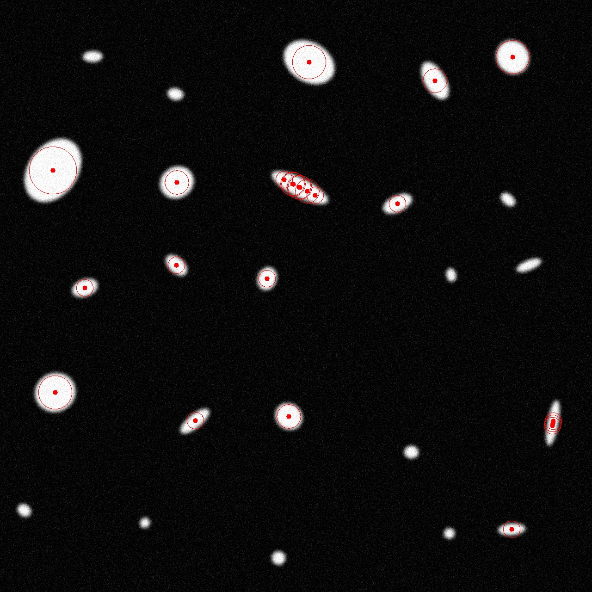

Детектор объектов (task06-01)
Задача:
Реализовать детектор блобов, соответствующих эллипсам, с использованием разностных гауссиан (DoG) и масштабной пирамиды.

Реализация
Построение масштабной пирамиды:

Из входного изображения в градациях серого создается пирамида с применением гауссового размытия.

Начальное значение сигмы — 1.6, количество уровней — 16, масштабный множитель k = sqrt(2.0).

```cpp
cv::GaussianBlur(current_level, blurred, cv::Size(0, 0), sigma);
sigma *= k;
```
DoG-пирамида (Difference of Gaussians):

На каждом уровне пирамиды разностное изображение вычисляется как разность гауссовых размытий соседних уровней.
```cpp
cv::subtract(pyramid[i], pyramid[i - 1], dog);
```


Поиск экстремумов в DoG-пирамиде:

Для каждого пикселя проверяется, является ли он локальным экстремумом в 3×3×3 окрестности (по координатам и уровням пирамиды).

Значения ниже заданного порога (threshold = 0.1) отбрасываются как шум.

Координаты экстремумов заносятся как cv::KeyPoint, где радиус пропорционален текущей сигме уровня.

```cpp
if ((val > 0 && val <= neighborVal) || (val < 0 && val >= neighborVal))
    isExtremum = false;
```

Формирование эллипсов:

Каждый ключевой элемент интерпретируется как круглый эллипс (в дальнейшем можно расширить до произвольных поворотов).

Оставляются только эллипсы с площадью не менее 900 пикселей.

```cpp
if (ellipse.size.area() >= 900) {
    ellipses.push_back(ellipse);
}
```

Сохранение и визуализация результатов:

На изображение наносятся эллипсы (в красном цвете) и центры.

```cpp
cv::ellipse(img, rect, cv::Scalar(0, 0, 255));
cv::circle(img, rect.center, 5, cv::Scalar(0, 0, 255), -1);
```



Blob detection с пирамидой масштабов и DoG показывает высокую точность, но он больше чувствителен чем детектор из лабораторной работы №4


