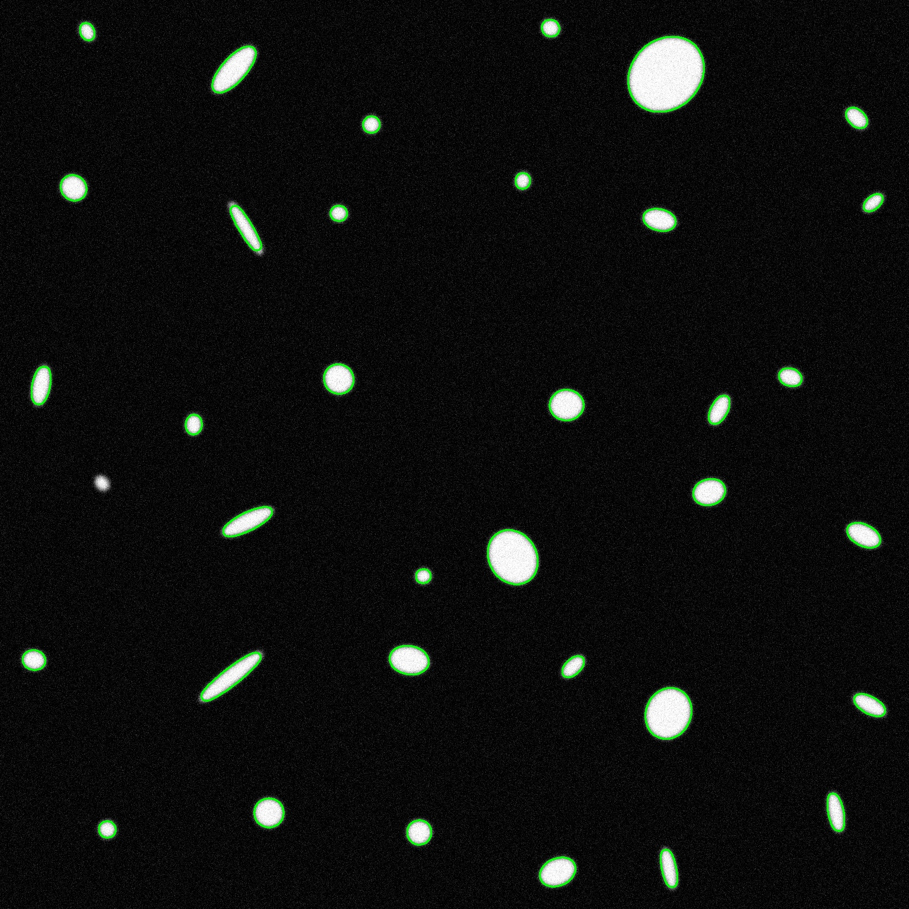

# Лабораторная 7
Детектор границ объектов (task07-01)
Задача:
Разработать детектор границ эллипсов с применением фильтрации, морфологических преобразований и извлечения контуров, совместимый с форматом лабораторной работы №4.

Реализация:

Предобработка изображения:

Изображение переводится в оттенки серого (cv::cvtColor).

Применяется гауссово размытие с ядром 25×25 для подавления шума.

Бинаризация изображения методом Отсу (cv::threshold с флагом THRESH_OTSU).

Морфологические операции:

Открытие (cv::MORPH_OPEN) — удаление шумов.

Закрытие (cv::MORPH_CLOSE) — сглаживание границ объектов.
Используется эллиптическое ядро размером 17×17.

```cpp
cv::GaussianBlur(gray, blurred, cv::Size(25, 25), 0);
cv::threshold(blurred, binary, 0, 255, cv::THRESH_BINARY | cv::THRESH_OTSU);
cv::morphologyEx(binary, processed, cv::MORPH_OPEN, kernel);
cv::morphologyEx(processed, processed, cv::MORPH_CLOSE, kernel);
```

Поиск и фильтрация контуров:

Используется cv::findContours в режиме RETR_EXTERNAL, метод CHAIN_APPROX_SIMPLE.

Фильтрация по площади: контуры с площадью меньше 450 пикселей отбрасываются.
```cpp
if (cv::contourArea(contour) > 450)
    filtered_contours.push_back(contour);
```

Сохранение результатов:

Координаты контуров сохраняются в JSON-файл (каждая точка как {x, y}).

Изображение с отрисованными контурами сохраняется и отображается.

```cpp
cv::drawContours(img, contours, -1, cv::Scalar(0, 255, 0), 2);
```

Оценка качества (task07-02)
Задача:
Оценить точность обнаружения границ эллипсов с помощью метрик:

IoU (Intersection over Union)

Precision

Recall

F1-score

Реализация:

Разбор данных:

Эталонные данные (ground_truth.json) парсятся из структуры: параметры эллипсов и координаты тайлов.

Прогнозы (predictions.json) загружаются как список контуров.

Эталонные эллипсы восстанавливаются через cv::RotatedRect и преобразуются в полигоны с помощью cv::ellipse2Poly.

Расчет IoU и метрик:

Каждая предсказанная фигура сравнивается с эталонной: если IoU ≥ 0.5 — считается TP.

Если ни с одной не совпало — FP. Неиспользованные GT — FN.

Метрики вычисляются по формулам:

precision = TP / (TP + FP)

recall = TP / (TP + FN)

F1 = 2 * (precision * recall) / (precision + recall)

Результаты тестирования

{
    "F1-score": 0.9859154929577464,
    "FalseNegatives": 1,
    "FalsePositives": 0,
    "Precision": 1.0,
    "Recall": 0.9722222222222222,
    "TruePositives": 35
}

Изображение с детекцией



Разработанный детектор границ на основе фильтрации, морфологических преобразований и извлечения контуров успешно справляется с задачей детекции эллипсов.

Полученные метрики (Precision, Recall, F1-score = 0.98) свидетельствуют об отличном совпадении предсказаний и эталона.


