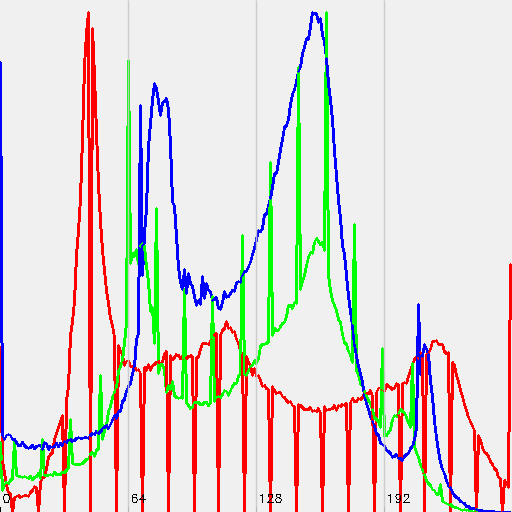
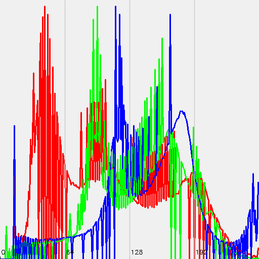

# Лабораторная 8

Цветокоррекция изображений (task08)

Задача:

Реализовать приложение, которое осуществляет цветокоррекцию изображения, сравнивая его с эталонным, с использованием алгоритмов серого мира и гистограммного сопоставления.

Реализация:

Цветокоррекция:

1. Gray World Correction

Цель: уравнять средние значения цветовых каналов.

Каждый канал умножается на фактор, основанный на отношении среднего по всем каналам к каждому каналу.

2. Histogram Matching

Приводит гистограмму input-изображения к виду гистограммы эталона (reference).

Рассчитываются кумулятивные гистограммы и строится соответствие яркостей.

Визуализация:

Гистограммы RGB каналов для input, reference, gray-world и histogram-stretching изображений.

Добавлены оси, сетка, подписи для лучшего сравнения.

Сравнение по метрикам:

MAE (mean absolute error)

PSNR (peak signal-to-noise ratio)

Тестовые пары:

В ходе тестирования использовались три пары изображений (input и reference).

Результаты для пары 1:

[Gray World Correction]
  MAE  (R,G,B): 14.2573, 16.2793, 26.1143
  PSNR (R,G,B): 22.5176, 22.6604, 19.3671

[Histogram Matching]
  MAE  (R,G,B): 8.85364, 5.06414, 4.6983
  PSNR (R,G,B): 26.8623, 32.1488, 32.0174

Вход

Эталонное

Коррекция по методу серого мира
Результат коррекции:

Гистограмма после коррекции:

Гистограммное сопоставление
Результат коррекции:

Гистограмма после коррекции:

Вывод
В рамках лабораторной работы была реализована консольная утилита task08, которая выполняет цветокоррекцию искажённого изображения на основе эталонного. Были применены два подхода:

Метод серого мира — простой и быстрый способ цветовой балансировки, выравнивающий средние значения каналов;

Гистограммное сопоставление — более точный метод, учитывающий распределение яркости и дающий лучшие визуальные и численные результаты.

Для каждого случая были построены цветовые гистограммы и рассчитаны метрики MAE и PSNR. По всем трём парам изображений гистограммное сопоставление показало более высокое качество коррекции по сравнению с методом серого мира.

Визуализация результатов и наличие количественной оценки позволяют делать обоснованные выводы о качестве алгоритмов. Разработанный инструмент может быть использован для предварительной коррекции изображений в различных прикладных задачах компьютерного зрения.